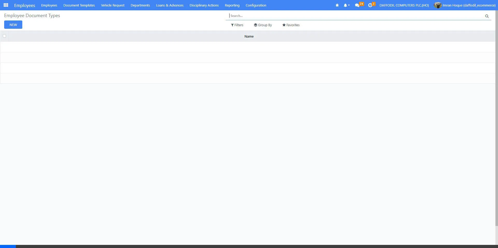
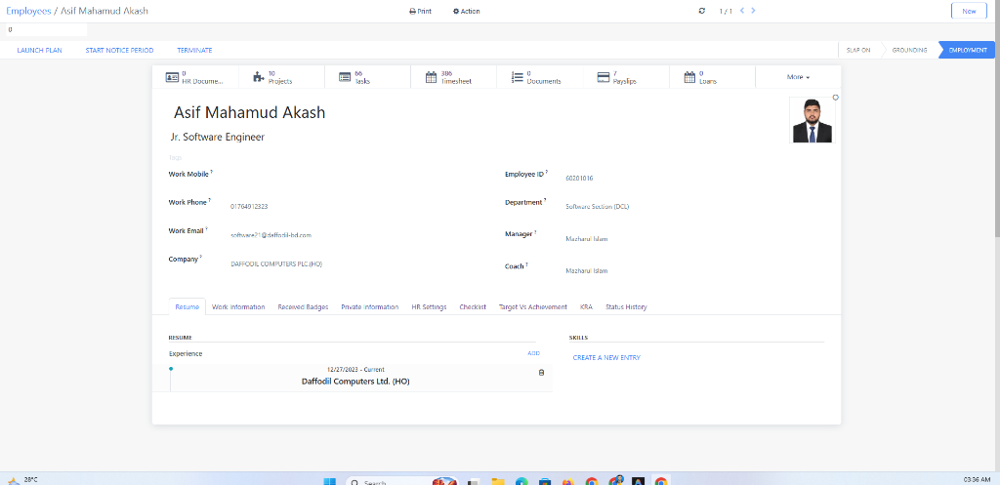

# DCL Employee Documents Notification - User Manual

This manual provides step-by-step instructions to configure and use the **DCL Employee Documents Notification** module in Odoo.

---

## 1. User Permission Setup
To grant access to manage and view documents:
1. Navigate to **Settings** ➔ **Users & Companies** ➔ **Users**.
2. Select the user and click **Edit**.
3. Under the **Access Rights** tab, locate the **DCL Documents** section.
4. Set the value to **Manager** and **Save** the record.

---

## 2. Configuration for Email Alerts
To configure global recipients who will receive expiry emails:
1. Navigate to **Settings** ➔ **Employees**.
2. Under the settings list, find the **HR Document Reminder Access** field.
3. Select the employees/HR managers who should receive the warning emails.
4. Click **Save**.

---

## 3. Creating Document Types & Templates
* **Document Types:** Navigate to **HR** ➔ **Configuration** ➔ **Document Types (DCL)**. Click **New** to define types like Passport, Driving License, or NID.
* **Document Templates:** Navigate to **HR** ➔ **Document Templates (DCL)** to set templates with default durations and warning options.

---

## 4. Registering a Document for an Employee
1. Go to **Employees** and open the employee’s profile.
2. Click the **HR Documents** smart button in the top-right corner.
3. Click **New** or **Create**:
   - Fill in **Document Name** (e.g. Visa 2026).
   - Select **Document Type**.
   - Input the **Expiry Date** and set the **Before Days** (e.g. 15 days).
   - Choose the **Notification Type** (on expiry, before expiry, daily till expiry, or daily after expiry).
   - Click **Attach Files** (Paperclip) to upload scanned PDF/image files.
4. Click **Save**.

